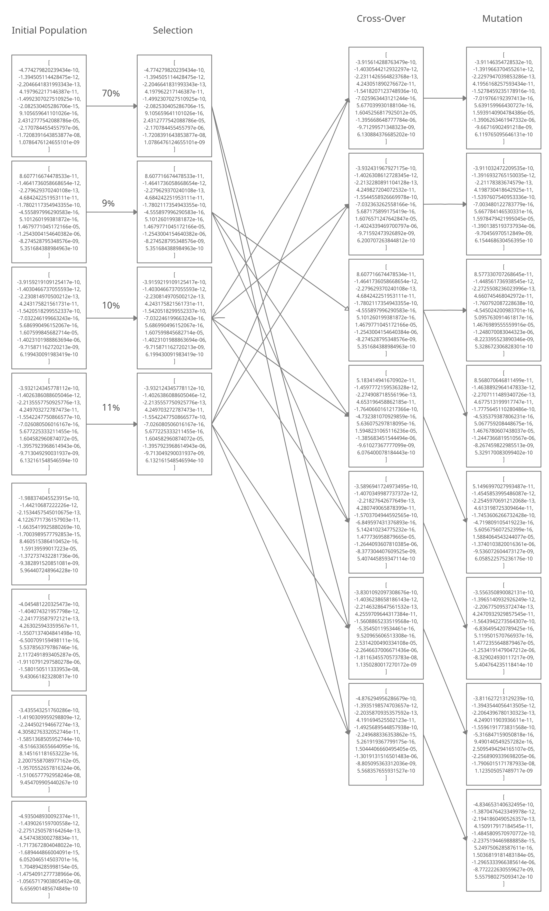
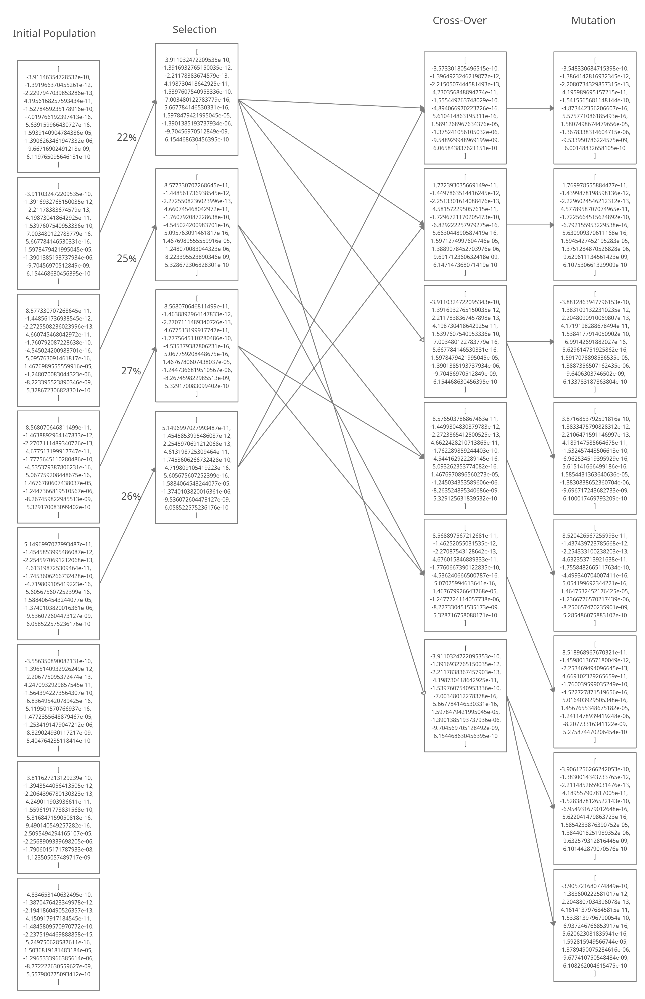
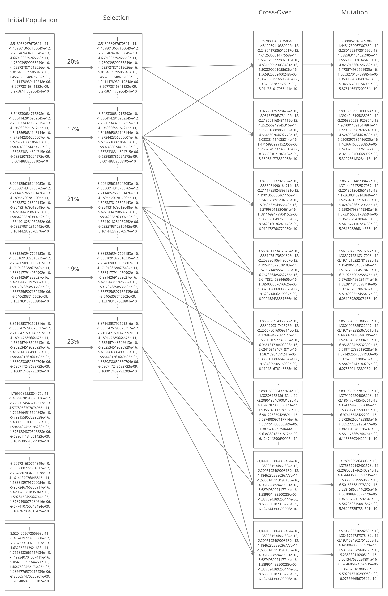
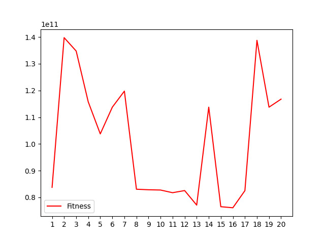
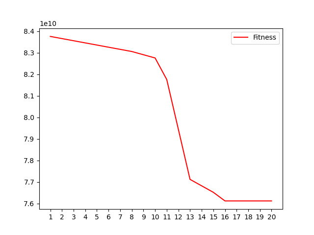

# Report

### Summary of Gentic Algorithm

Genetic algorithm is an adaptive methods which may be used to solve search and optimisation problems based on the genetic processes of biological organisms. In this use case we are using this to generalize the given model by reducing overfitting. This algorithm is based on principles of natural selection and survival of the fittest. By mimicking this process, genetic algorithms are able to "evolve" solutions to real world problems. It envolves [X] steps ...

#### Step 1 : Generate initial set of population 
In this step we will be generating population set from the initial array which will be used to start.
#### Step 2 : Getting fitness value for each individuals
In this step we calculate fitness scores of each individual by using a kind of fitness function which can depend on various factors and high fitness means they have performed better.
#### Step 3 : Selection
In this step we are prefering the individuals with more fitness scores and allowing them to pass there genes to the successive populations.
#### Step 4 : Crossover
In this step we do mating to generate new individiuals by choosing 2 indiviuals from the population set and do some operation to generate 2 new indiviuals.
#### Step 5 : Mutation
In this step we are adding some random noises to a chromosome in crossovered genes of new individuals to make population more diverse.
#### Step 6 : Repeating steps
In this step we will repeating all the above steps but just using the mutated population as initial population set instead of step1 to generate next generations.

### Major changes
+ In selection , we have modified the general roulete wheel selection method by decreasing the chances of the least `population_size/3` to get selected to zero . As these are the chromosome which performed poorly on the trainig and validation set so they will make unfit offsprings.
+ In cross-over , first we have used simulated binary crossover , we are making crossovered population as linear equation for two variables for both selected offsprings as 
   + children1 = 0.5 * ( (1+$\beta$ ) * parent1 + (1-$\beta$ ) * parent2 )
    + children2 = 0.5 * ( (1+$\beta$ ) * parent2 + (1-$\beta$ ) * parent1 )
  and then we are mixing both child from a certain random index as explained in crossover function.
###### NOTE : final functions used are mentioned under there respective heading and reason for the same is mention in heuristics 

### Diagram

### Initial population generation
Since we have only one vector as a initial population and needs a set of population for the implementation so we are generating a population set named `population` of size `population_size` by generating duplicate arrays of given vector and adding some random noise into each chromosome by using function `add_noise_populate` 
### Fitness funtion
We are using `validation_error` and `training_error` returned from `get_error` function in `client.py` and used the negative of there sum as the parameter for our fitness function.

### Selection Function 
We are selecting the chromosomes using Roulette Wheel Selection ,More the fitness value , more is it chance to get selected. A general modification we have done in this is to dump the `population_size/3` chromosome who are least in fitness by reducing its chances to get selected to 0.
### Crossover function
+ Initially, we implemented a simple single point crossover where the first parent was copied till a certain index, and the remaining was copied from the second parent. However, this offered very little variations as the genes were copied directly from either parent. 
+ Later we shifted to a new method for adding more variation in new crossovered population. The equation for new offsprings stated as
    + children1 = 0.5 * ( (1+$\beta$ ) * parent1 + (1-$\beta$ ) * parent2 )
    + children2 = 0.5 * ( (1+$\beta$ ) * parent2 + (1-$\beta$ ) * parent1 )
 
  where $\beta$ is a random value between 0 and 1
Finally we have implemented both the methods to increase the mixing of the two parents chromosomes. 
### Mutation function
We are adding random noises to each chromosome in newly generated offsprings after crossover with a probability `Mutation_Probability` and added noises are some fraction of there chromosome's initial value and factor is represented as `Mutation_Difference_Scale` 
### Hyper Parameter
+ `initial_array = [0.0, -1.45799022e-12, -2.28980078e-13,  4.62010753e-11, -1.75214813e-10, -1.83669770e-15,  8.52944060e-16,  2.29423303e-05, -2.04721003e-06, -1.59792834e-08,  9.98214034e-10]`
+ `chromosome_size = 11` number of gene in chromosome
+ `max_limit = 10` maximum value for a gene
+ `min_limit = -10` minimum value for a gene 
+ `generations` number of generations we needed to generate , we have tried generations = 10 , 15, 20, 25. but increasing number of generations above 25 have no effect in decreasing error.
+ `population_size` number of individuals in a generation we took bunch of different values from 8 to 50, due to restriction on call limits on server we have used only 8 - 20 population size mostly but we have observed that we are getting better values mostly in 8. 
+ `population` set of individuals in a generation
+ `Mutation_Probability` probability factor for performing mutation in an individuals which was set as random value
+ `Mutation_Difference_Scale` fraction of noise added to the initial chromosome which was set as random value
+ `best_weights_set` stores best vector among `genrations*population_size` 
+ `fitness_best_weights` stores fitness score of the best vector
 
### Stats
+ Since all the steps of genetic algorithm uses random number as one of its parameter , we have seen that it converges at different iterations. 
+ Our best vector's converges on generation 16 
+ Graph for fittness score of best individaul in each generation   
+ Graph for fittness score of best individaul till `i`th generation    
+ And other submitted vectors converges between 3-12
+ Other non submitted vectors converges in range of 2 to 23
### Heuristics
#### Initial popualtion generation
+ Initially we were generating new population by adding a uniform noise (val/Mutation_Difference_Scale) to each gene but we observed that doing this results in gene having value 0 in chromosome remains 0 in other chromosome of initial population. 
+ Later we observed that by this we have neglected one feature always which is one of our causes for high error than we tried to add some variations to that gene having value 0 by adding the some fraction of mean of that chromosome.
+ One more thing which we added is after observing many graphs and chromosomes we have find some best vectors and we tried to add them to the initial population so there will be more competition and we can get much better model. But giving it more and more best chromosomes in initial population resulting in constant value of error , we are not able to go downward so, we skipped giving more and more known chromosome in the initial population.
#### Selection
+ Initially we were using simple Roulette wheel selection method for selecting the chromosomes. By choosing this method, there are chances that chromosome having least fitness can also be selected many times due to uniformity in selection process.
+ So to handle this situation, we decided to drop a few inndividuals having least fitness so that they are not selected to crossovered, this also have reduced our error significantly.
#### Crossover
+ For crossover also , during starting few days we are not doing crossover at all.
+ Then we have tried crossover by selected an index randomly between 0 to 11 till which we are interchanging the genes of the chromosome.
+ By doing this our error was reduces but not to great extent so we decided to use  simulated binary crossover and made crossovered population as linear equation for two variables for both selected offsprings as 
    + children1 = 0.5 * ( (1+$\beta$ ) * parent1 + (1-$\beta$ ) * parent2 )
    + children2 = 0.5 * ( (1+$\beta$ ) * parent2 + (1-$\beta$ ) * parent1 )
  and then we are mixing both the child from a certain random index as explained in crossover function. This reduced our error value and helped us in obtaining best vectors.
#### Mutation
+ In mutation ,we were initially mutating with fixed `Mutation_Probability` of 0.2 and then later changed to 0.4 along with adding very small values.
+ Then we were shifted our `Mutation_Probabilty` to random value between 0.4 to 0.8 and faction of value added as noise from `val/10` to `val/1000` every time.
+ Since higher `Mutation_probability` was reducing our error so we thought of increasing this to a greater extent by fixing `Mutation_Probability` to `1` and fraction of values to be same as them but that resulted in increased error, maybe due it is crossing the minima of error due to large steps. So we have finally implemented the 2nd strategy.

## Best Vector
### Vector 
`[ 7.003299481921903e-10,
    -1.2866810779862577e-12,
    -2.1287433419254792e-13,
    4.197014580025532e-11,
    -1.3887325310573055e-10,
    -3.95380697461577e-16,
    5.693708194078502e-16,
    1.6664030711626816e-05,
    -1.3900293265218616e-06,
    -8.948997464754996e-09,
    5.867012483104818e-10
  ]`
### Errors
#### Validation error 
`28439937487.903503 `
#### Training error
`47681643278.42501`
### Our reason to choose it best
Since this is the best vector having lowest validation + training error we are able to achieve. Moreover , Since training error is minimum indicating it is able to copy the data set and validation error is minimum implies that our model not only performs well on data set but also generalizes the data set well , So, it have great chances of working well on test set. Moreover , since validation error is lower than training error indicating that the model is not overfitting the training set.
